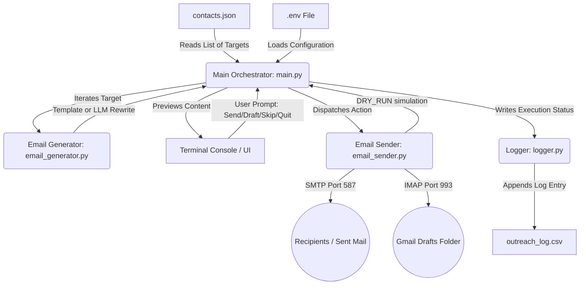
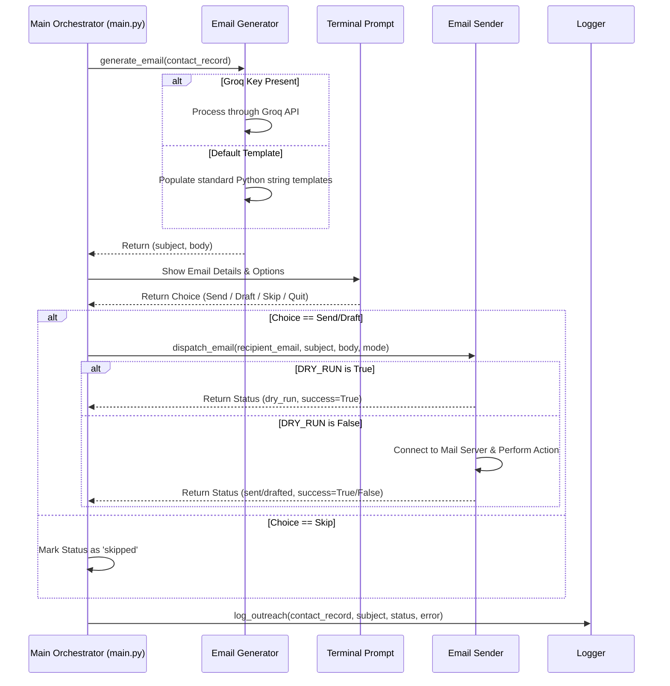

# System Architecture: The Closer (Cold Email Writer + Send Bot)

This document describes the design and modular architecture of **The Closer**, a cold email generation and automation agent. It outlines the data model, components, flow of execution, and security safeguards built into the system.

---

## 1. High-Level Architecture Overview

The system is designed with a **modular, pipeline-oriented architecture** that decouples the input processing, content generation, external mail communication, and logging subsystems. This ensures that individual components can be tested and modified independently (e.g., swapping a template generator for an LLM rewrite service, or shifting from standard SMTP to the Gmail REST API).



---

## 2. Core Subsystems & Components

### A. Configuration & Inputs (Data Layer)
- **`contacts.json`**: A structured database of outreach targets.
  ```json
  [
    {
      "recipient_name": "Priya Sharma",
      "recipient_email": "priya@example.com",
      "company": "Acme AI",
      "role": "Backend Engineering Intern",
      "job_url": "https://example.com/job",
      "personalization_note": "saw that your team recently launched...",
      "candidate_name": "Aditya Rane",
      "candidate_background": "Python developer interested in automation...",
      "portfolio_url": "https://github.com/yourname"
    }
  ]
  ```
- **`.env` Configuration**: Houses host details, credentials, dry-run flags, and API keys. Decouples credentials from the code to prevent accidental credential leakage.

### B. Email Generation Subsystem (`email_generator.py`)
Responsible for crafting high-conversion outreach emails matching the structure guidelines (under 150 words, single call-to-action, customized personalization hook).
- **Template Generator**: A deterministic formatter mapping variables from `contacts.json` directly into structured paragraphs.
- **LLM Generator (Groq)**: An optional upgrade using the `groq` SDK. If a `GROQ_API_KEY` is provided, the subsystem utilizes a customized system prompt to rewrite the draft for maximum natural tone and polished structure while preventing hallucinations of background experience.

### C. Email Sender Subsystem (`email_sender.py`)
Interfaces with the mail delivery protocols while strictly adhering to safety configurations.
- **SMTP Agent**: Establishes secure TLS connection (usually on port 587) with the configured mail server and dispatches MIME-formatted multipart messages.
- **IMAP Agent**: Connects securely via SSL (usually on port 993) to the mail server, and appends generated messages directly to the server's `[Gmail]/Drafts` folder. This is a secure, interactive alternative that allows human editing of the email inside their actual client before hit-send.
- **Safety Handler**: Inspects the `DRY_RUN` configuration parameter. When `true`, it bypasses active server socket creation and prints a mock sending action to the console instead.

### D. Logging Subsystem (`logger.py`)
Captures full trace history of outreach actions for auditing and performance indicators.
- **`outreach_log.csv`**: A local ledger updating after every email process. Fields logged:
  - `timestamp`: ISO 8601 formatted date-time string.
  - `recipient_email`: The address targeted.
  - `company`: Target organization.
  - `role`: Position applied for.
  - `subject`: The subject line.
  - `status`: Outcome code (`dry_run`, `sent`, `drafted`, `skipped`, `failed`).
  - `error_message`: Empty or filled with python traceback if a mail dispatch fails.

### E. CLI Orchestration Subsystem (`main.py`)
Coordinates loop execution, prompts, console formatting, and error handling.
- Displays full terminal previews including Subject, Body, and Recipients.
- Captures confirmation input keys: `s` (Send), `d` (Draft), `k` (Skip), `q` (Quit).

---

## 3. Data Flow & Lifecycles

### A. Lifecycle of an Outreach Action



---

## 4. Key Security & Safety Guardrails

1. **Dry-Run Enforcement**: By default, `DRY_RUN` is set to `true` in the environment template. The app prevents network transmissions unless this flag is explicitly turned off by the user.
2. **Gmail App Password Requirement**: The SMTP/IMAP protocol modules explicitly require password inputs. Documentation instructs users to create a restricted App Password rather than using their master account password.
3. **Draft Mode Priority**: A designated draft mode allows emails to go directly to the Gmail drafts folder, giving the user a final check in their Gmail web interface before sending.
4. **Volume Limiter**: The application iterates over local JSON targets. It is structurally limited to prevent automated mass-mailing, aligning with anti-spam best practices.
